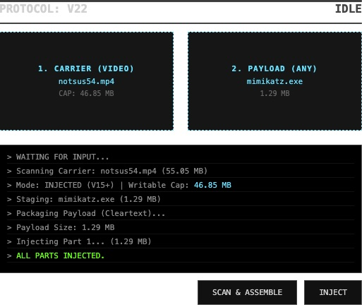
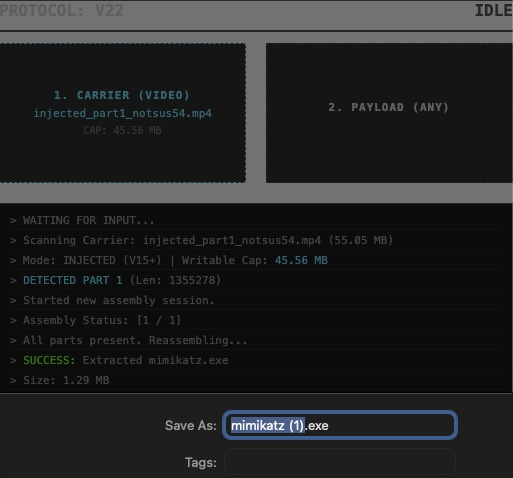
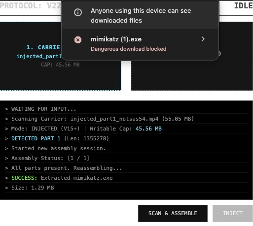
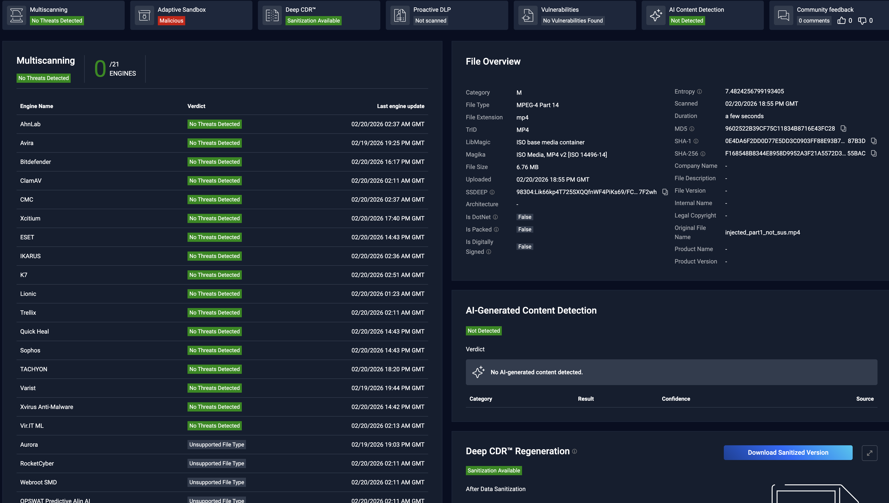

# **Subtitle Injector**

Polyglot generator for media files... well, it was. Then I hijacked this repo to try and bypass CDRs (Content Disarm and Reconstruction).

**VIBE CHECK / DISCLAIMER:**

Just a heads up: I am *not* a developer. A lot of this project is heavily "vibecoded" or straight-up AI-generated. If you look at the source code and it looks like a chaotic fever dream, that's why. I'm just out here mashing things together until they do what I want.

## **The Goal**

The main objective of this repo has evolved into sneaking payloads past strict file-sanitization systems. Currently, my primary method is hiding arbitrary HTML inside an MP4 Video/Audio file using the subtitle\_injector\_encrypt.py script.

**Goal is to bypass CDR:**

See the results here: [Metadefender Report](https://metadefender.com/results/file/bzI2MDIyMFBrTEMxenlMYlpob3hJWWxSY28_mdaas)

## **How The Subtitle Exploit Works**

Unlike other polyglot generators that use MP4 skip or free atoms to hold payload data, I built this tool to use a **subtitle track** (specifically the mov\_text timed text track) to allocate space. Then, it overwrites the subtitle binary stream with the payloads.

The script constructs a polyglot file using the following sequence:

1. **Magic FTYP Header**: It crafts a 256-byte ftyp header for the MP4 and overwrites the first compatible brand with \<\!-- (\\x3C\\x21\\x2D\\x2D), the start of an HTML comment. Web browsers will now ignore the initial binary sequence.  
2. **Transcoding**: The input media gets transcoded via ffmpeg to H.264/AAC MP4 with mov\_text compatibility to ensure a clean container.  
3. **Subtitle Track Allocation**: It creates a standard SRT file (payload.srt) containing a unique marker ($$POLYGLOT\_PAYLOAD\_START$$) and a massive sequence of padding characters. This is muxed into the media as a timed text track (-c:s mov\_text), reserving space directly inside the media stream.  
4. **Payload Injection**: It scans the compiled MP4 binary for the marker and replaces the padding with the HTML payload.  
   * Closes the initial comment (--\>).  
   * Adds CSS to hide the raw binary garbage from the page layout (body { visibility: hidden; }).  
   * Executes window.stop() in JS to prevent the browser from loading trailing binary contents.  
   * Appends \<\!-- to comment out any remaining binary data.

### **The Subtitle Variation Trick**

To make this look completely legit, I added a VARIATIONS array that cycles through 6 common subtitle types for every language:

* Normal (Standard translation track, no title appended)  
* SRT (Subtitle text)  
* SDH (Subtitles for the Deaf and Hard of hearing)  
* Forced (Forced Narrative)  
* CC (Closed Captions)  
* Commentary (Director's commentary)

By pairing our 92 supported VLC language codes with these 6 variations, the script can seamlessly generate 552 perfectly natural-looking subtitle tracks before it ever runs out of combinations and has to fall back to sequential numbering.

For a typical 60-second video, you'd now be able to easily hide nearly 200 MB of encrypted payloads without raising any suspicion in standard media players. Your video's subtitle selection menu will just look incredibly comprehensive\!

### **The Scatter-Gather Web GUI**

I also included subtitle\_injector\_encrypt.html, a browser-based companion tool. Once you've pre-allocated space in a carrier video via the Python script, you can load it into this frontend interface to dynamically encrypt, inject, or extract payloads purely via JavaScript (supporting chunked base64 or binary data formats) without needing the command line.

### **Headless Extraction (Windows)**

If you need to retrieve the injected data without visiting the polyglot webpage or interacting with a browser, I included headless extraction tools for Windows via PowerShell:

* **extract.ps1**: For extracting standard/unencrypted payloads hidden in the subtitles.  
* **extract\_decrypt.ps1**: For extracting and simultaneously decrypting payloads if an encryption key was used during injection.

## **Dependencies & Setup**

**System Requirements:**

* **Python 3**  
* **FFmpeg** (ffmpeg and ffprobe): For transcoding the media file and muxing tracks.  
* **Bento4** (mp4edit): For patching and replacing the ftyp header. This needs to be in your working directory or PATH (sudo mv Bento4-SDK-1-6-0-641.x86\_64-unknown-linux/bin/\* /usr/local/bin/).

## **Usage**

The CLI tool acts as the heavy lifter for dropping HTML into MP4s via subtitle tracks and allocating space for the web GUI.

\# Basic usage  
$ python3 subtitle\_injector\_encrypt.py \<output\> \<video\> \-H subtitle\_injector\_encrypt.html \-S 2

\# Example: Embed an HTML Page in a Video  
$ python3 subtitle\_injector\_encrypt.py play.mp4 raw\_video.mov \--html subtitle\_injector\_encrypt.html

\# Example: Pre-allocate 5MB inside the subtitle stream for a larger payload later  
$ python3 subtitle\_injector\_encrypt.py output.mp4 video.mp4 \--html subtitle\_injector\_encrypt.html \--size 5

**Options:**

* \-H / \--html: Path to the HTML document to embed. Defaults to a placeholder header if omitted.  
* \-S / \--size: Force allocation size in Megabytes (MB). Useful for pre-allocating space for large payloads injected via the web GUI later.

## **Technical Notes and Limitations**

1. **Subtitle Fragmentation:** MP4 subtitle tracks were meant for short text strings, not megabytes of data, so FFmpeg normally caps a single subtitle packet around 60KB. To get around this, I trick FFmpeg into allocating a ton of space by slicing your requested size into thousands of smaller chunks. But injecting a massive file straight over those chunk boundaries is still a heavy hack. It works, but if you're embedding a huge file, just make sure the video still plays correctly afterward.  
2. **Lossy Pre-processing:** The video (or audio) input gets fully re-encoded to an MP4 (H.264/AAC) format to ensure a clean, predictable container layout before the FTYP hack and subtitle muxing occur.  
3. **Tolerance:** Because of the unholy beheadings that this script performs on file headers, some less tolerant (or less compliant) programs may fail early with errors about bad metadata or file types.
